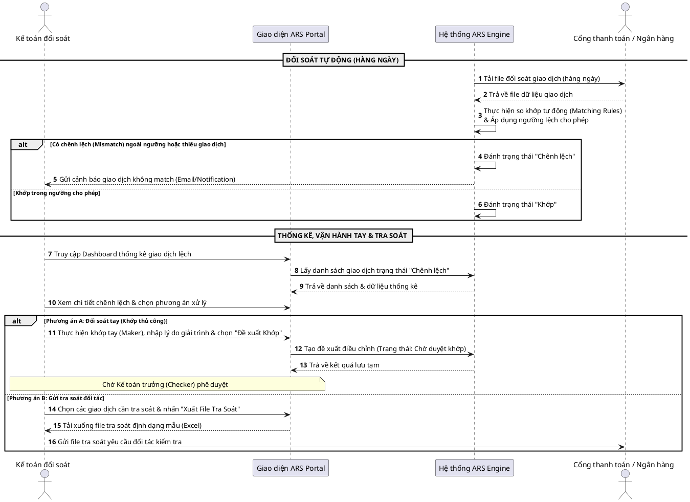

# Tài liệu Brainstorm: Tính năng Đối soát Tự động & Thủ công (ARS)

> Bối cảnh: automated-reconciliation | Ý tưởng: reconciliation-brainstorm

## 1. Mục tiêu nghiệp vụ (Cockburn Goal Levels)

*Mô tả mục tiêu của tính năng theo 3 mức độ Cockburn để định vị chính xác phạm vi nghiệp vụ.*

- **Mức độ Summary (Cloud/Kite - Tầm nhìn vĩ mô)**:
  - Tự động hóa và quản lý tập trung toàn bộ quy trình đối soát giao dịch dòng tiền của doanh nghiệp với các đối tác (cổng thanh toán, ngân hàng), giảm thiểu 90% thao tác thủ công và phát hiện sớm chênh lệch để tránh thất thoát tài chính.
- **Mức độ User Goal (Sea Level - Mục tiêu người dùng)**:
  - Cấu hình và khai báo ngưỡng chênh lệch cho phép (Tolerance Threshold).
  - Kích hoạt/Chạy luồng đối soát tự động định kỳ hoặc đột xuất.
  - Tra cứu, lọc danh sách giao dịch và xem trạng thái đối soát.
  - Thống kê và báo cáo danh sách các giao dịch không khớp (mismatch/unmatched) để thực hiện vận hành xử lý tay hoặc gửi yêu cầu kiểm tra/tra soát (dispute/investigation request) sang phía đối tác/cổng thanh toán.
  - Thực hiện đối soát thủ công (khớp tay, xử lý lệch) cho các giao dịch bị cảnh báo chênh lệch dưới cơ chế Maker-Checker.
  - Xuất báo cáo kết quả đối soát định kỳ (ngày/tuần/tháng).
- **Mức độ Subfunction (Fish/Clam - Chức năng hỗ trợ chi tiết)**:
  - Import/Đọc file đối soát từ đối tác (ngân hàng, cổng thanh toán Momo, VNPay,...).
  - So khớp tự động các trường thông tin (Mã giao dịch, Số tiền, Trạng thái) theo thuật toán matching.
  - Bắn cảnh báo (email, notification nội bộ) khi phát hiện giao dịch không khớp ngoài ngưỡng.
  - Lưu vết lịch sử thao tác đối soát thủ công (Audit Trail).

## 2. Nhu cầu nghiệp vụ (5W1H Framework)

*Làm rõ nhu cầu nghiệp vụ để giải quyết vấn đề cốt lõi của người dùng.*

- **Who (Ai tham gia/sử dụng)**:
  - **Bên liên quan (Stakeholders)**: Kế toán trưởng (CFO), Ban Giám đốc (CEO), Bộ phận Kiểm toán độc lập.
  - **Người dùng cuối (End-users)**: Nhân viên Kế toán đối soát (Reconciliation Officer - Maker), Nhân viên Vận hành hệ thống (Ops Admin - Maker), Kế toán trưởng (Checker).
- **Why (Tại sao cần tính năng này)**:
  - Thay thế quy trình đối soát thủ công bằng Excel tốn thời gian, dễ sai sót và khó phát hiện chênh lệch nhỏ lẻ tích tụ. Phát hiện nhanh các giao dịch lỗi từ phía đối tác để đối chiếu thu hồi dòng tiền.
- **What (Nghiệp vụ này là gì)**:
  - Hệ thống tự động thu thập dữ liệu giao dịch từ Core System và đối tác, thực hiện so khớp tự động, cảnh báo chênh lệch và hỗ trợ kế toán xử lý thủ công các ca lệch theo cơ chế Maker-Checker.
- **When (Khi nào trigger nghiệp vụ)**:
  - *Đối soát tự động*: Tự động chạy hàng ngày (ví dụ: 01:00 AM) sau khi hệ thống nhận được dữ liệu hoàn tất từ đối tác.
  - *Đối soát thủ công & báo cáo*: Thực hiện vào đầu ngày làm việc hoặc khi có cảnh báo chênh lệch từ hệ thống.
- **Where (Áp dụng tại phân hệ nào)**:
  - Cổng quản trị nội bộ dành cho bộ phận Kế toán & Vận hành (Back-office Admin Portal).
- **How (Vận hành cơ bản như thế nào)**:
  - Hệ thống tải tệp dữ liệu giao dịch -> So khớp tự động dựa trên thuật toán khớp mã giao dịch -> Nếu số tiền chênh lệch $\le$ ngưỡng cho phép, tự động đánh trạng thái "Khớp" -> Nếu chênh lệch > ngưỡng hoặc lệch trạng thái, đánh trạng thái "Chênh lệch" và bắn cảnh báo -> Kế toán kiểm tra và xử lý thủ công (Maker đề xuất điều chỉnh, Checker duyệt).

## 3. Hành trình người dùng & Hệ thống (User & System Journey)

*Sơ đồ PlantUML mô tả tương tác và luồng đi của hành trình nghiệp vụ.*

*Mô tả chi tiết các bước hành trình nghiệp vụ:*
1. **Bước 1 (Xử lý tự động)**: ARS Engine tự động tải file giao dịch từ đối tác cổng thanh toán vào ban đêm, so khớp với dữ liệu Core System. Nếu khớp dưới ngưỡng lệch cho phép, chuyển trạng thái là "Khớp". Nếu lệch ngoài ngưỡng hoặc thiếu giao dịch một bên, chuyển trạng thái thành "Chênh lệch" và thông báo cho Kế toán đối soát.
2. **Bước 2 (Xử lý thủ công)**: Kế toán đăng nhập Portal, xem danh sách giao dịch lệch. Kế toán có thể chọn đối soát tay (làm Maker tạo đề xuất khớp thủ công kèm giải trình và chờ Checker duyệt) hoặc xuất danh sách giao dịch lệch sang file Excel để gửi yêu cầu tra soát sang đối tác thanh toán.

## 4. Danh sách tính năng (CRUD Brainstorming) & Business Rules

### 4.1 Danh sách tính năng đề xuất qua lăng kính CRUD

| Thực thể nghiệp vụ | Tạo (Create) | Đọc (Read) | Cập nhật (Update) | Xóa (Delete) |
|--------------------|--------------|------------|-------------------|--------------|
| **Dữ liệu Giao dịch** *(Transaction)* | Hệ thống tự động import từ đối tác và Core System (Không cho phép tạo thủ công). | - Xem danh sách giao dịch. - Lọc giao dịch theo: Đối tác, Khoảng thời gian, Số tiền, Trạng thái (Khớp, Chênh lệch, Đối soát tay). | Cập nhật trạng thái đối soát (từ "Chênh lệch" sang "Khớp thủ công") khi kế toán xử lý lệch dòng tiền. | **Cấm xóa** dữ liệu giao dịch gốc để phục vụ kiểm toán và lưu vết dòng tiền. |
| **Ngưỡng lệch cho phép** *(Tolerance Threshold)* | Tạo mới cấu hình ngưỡng lệch (số tiền chênh lệch tối đa cho phép hoặc tỉ lệ % sai số). | Xem lịch sử các cấu hình ngưỡng lệch đang và đã áp dụng trong hệ thống. | Thay đổi giá trị ngưỡng lệch (ví dụ: chuyển từ 1,000 VND sang 2,000 VND). | Vô hiệu hóa cấu hình ngưỡng lệch (đưa về mặc định = 0). Không xóa cứng lịch sử. |
| **Lượt đối soát** *(Reconciliation Run)* | - Tự động tạo lượt đối soát theo lịch (Scheduler hàng ngày). - Kế toán trigger chạy đối soát thủ công lập tức cho một ngày cụ thể. | Xem danh sách các lượt đối soát: Thời gian chạy, trạng thái chạy (Thành công/Lỗi), tỉ lệ khớp, số lượng giao dịch lệch. | **Không cho phép sửa** kết quả lượt đối soát sau khi đã thực thi xong. | **Cấm xóa** lịch sử chạy đối soát. |
| **Yêu cầu tra soát** *(Dispute / Investigation)* | Tạo mới yêu cầu tra soát cho danh sách các giao dịch chênh lệch để gửi sang đối tác cổng thanh toán. | - Xem danh sách yêu cầu tra soát. - Xuất file Excel yêu cầu tra soát theo mẫu định dạng gửi đối tác. | Cập nhật trạng thái yêu cầu tra soát (Chờ gửi, Đang xử lý, Đã khớp/Hoàn tất, Đã hủy). | Không xóa yêu cầu tra soát, chỉ cho phép chuyển sang trạng thái "Đã hủy". |

### 4.2 Quy tắc nghiệp vụ (Business Rules)

*Các quy định, kiểm tra, và ràng buộc nghiệp vụ bắt buộc hệ thống phải tuân theo.*

- **BR-automated-reconciliation-001**: Hệ thống đối soát phải sử dụng **Mã giao dịch duy nhất** (Transaction ID / Partner Ref ID) làm khóa khớp dữ liệu giữa các nguồn.
- **BR-automated-reconciliation-002**: Một giao dịch được tự động ghi nhận là "Khớp" nếu và chỉ nếu:
  1. Trùng khớp mã giao dịch ở cả hai nguồn dữ liệu.
  2. Giá trị chênh lệch tuyệt đối: $|Amount_{Core} - Amount_{Partner}| \le$ Ngưỡng lệch cho phép đang hoạt động tại thời điểm chạy đối soát.
  3. Trạng thái giao dịch ở hai bên đều là thành công.
- **BR-automated-reconciliation-003**: Khi cập nhật trạng thái giao dịch từ "Chênh lệch" sang "Khớp thủ công" (đối soát tay), hệ thống bắt buộc Maker phải nhập **Lý do giải trình chênh lệch** (tối thiểu 10 ký tự), đính kèm mã tham chiếu chứng từ/giao dịch bù trừ (nếu có), và hệ thống bắt buộc ghi log Audit Trail chi tiết (Ai làm, Lúc nào, Nội dung thay đổi, Lý do).
- **BR-automated-reconciliation-004**: Phân quyền vai trò người dùng:
  - Chỉ người dùng có vai trò *Kế toán đối soát* mới có quyền xử lý đối soát tay và tạo yêu cầu tra soát.
  - Chỉ người dùng có vai trò *Kế toán trưởng* hoặc *Admin* mới có quyền cấu hình/chỉnh sửa Ngưỡng lệch cho phép.
- **BR-automated-reconciliation-005**: Cơ chế Maker-Checker cho việc khớp thủ công: Mọi đề xuất khớp thủ công do Kế toán đối soát (Maker) lập đều phải được Kế toán trưởng (Checker) xem xét và phê duyệt trên hệ thống mới chính thức chuyển trạng thái giao dịch thành "Khớp thủ công".

## 5. Luồng ngoại lệ & Rủi ro nghiệp vụ (Exception Flows & Risks)

### 5.1 Các luồng ngoại lệ (Exception Flows)

- **EF-automated-reconciliation-001 (Lỗi kết nối API đối tác / Thiếu dữ liệu quyết toán)**: Đến giờ chạy đối soát tự động nhưng hệ thống không kết nối được với API đối tác hoặc không nhận được dữ liệu quyết toán của ngày đó. Hệ thống tạm dừng lượt đối soát của ngày đó, chuyển trạng thái lượt đối soát thành "Lỗi kết nối / Thiếu dữ liệu" và gửi cảnh báo khẩn cho Kế toán đối soát/Ops.
- **EF-automated-reconciliation-002 (Lỗi định dạng file đối soát)**: File đối soát nhận được bị thay đổi cấu trúc đột ngột. Hệ thống dừng quá trình import, đánh trạng thái lượt đối soát là "Lỗi định dạng file", ghi log lỗi parse chi tiết và bắn cảnh báo hỗ trợ kỹ thuật.
- **EF-automated-reconciliation-003 (Lệch trạng thái giao dịch nghiêm trọng)**: Core System báo giao dịch "Thất bại" nhưng đối tác báo "Thành công" và đã trừ tiền (hoặc ngược lại). Hệ thống đẩy giao dịch vào danh sách chênh lệch nghiêm trọng (High Priority Mismatch) và cảnh báo Kế toán xử lý thủ công khẩn cấp trong vòng 24h.
- **EF-automated-reconciliation-004 (Trùng lặp dữ liệu trong file đối tác)**: File đối soát của đối tác gửi chứa các bản ghi bị trùng mã giao dịch. Hệ thống tự động lọc bỏ bản ghi trùng trước khi chạy đối soát và báo cáo số lượng bản ghi trùng lặp trong log đối soát.
- **EF-automated-reconciliation-005 (Thiếu giao dịch một phía)**: Giao dịch tồn tại ở một bên nhưng không tìm thấy ở bên còn lại (Ví dụ: Có ở Core nhưng thiếu ở đối tác -> trạng thái "Thiếu giao dịch đối tác"; Có ở đối tác nhưng thiếu ở Core -> trạng thái "Thiếu giao dịch Core - Giao dịch mồ côi" kèm cảnh báo khẩn).

### 5.2 Rủi ro nghiệp vụ & Giải pháp phòng ngừa (Risks & Mitigations)

| Rủi ro nghiệp vụ | Khả năng xảy ra | Tác động nghiệp vụ | Giải pháp phòng ngừa đề xuất |
|-------------------|-----------------|-------------------|-----------------------------|
| **R-001**: Thất thoát tài chính do nhân viên cố ý hoặc vô ý khớp tay các giao dịch chênh lệch mà không được kiểm soát. | Trung bình | Cao | Áp dụng cơ chế Maker-Checker theo **BR-automated-reconciliation-005**. Tất cả các điều chỉnh khớp tay bất kể giá trị chênh lệch đều phải có phê duyệt từ Kế toán trưởng. |
| **R-002**: Lệch múi giờ ghi nhận giao dịch giữa hai hệ thống dẫn đến chênh lệch giả (ví dụ: giao dịch 23:59:59 ngày T so khớp với giao dịch 00:00:01 ngày T+1). | Cao | Trung bình | Khi đối soát ngày T không khớp, hệ thống tự động quét mở rộng sang các giao dịch chưa đối soát của ngày T-1 và ngày T+1 (phạm vi +/- 24 giờ) để tìm kiếm so khớp trước khi kết luận lệch. |
| **R-003**: Kênh kết nối tự động tải dữ liệu hoặc API IPN gặp sự cố kéo dài gây gián đoạn quy trình đối soát. | Thấp | Cao | Thiết kế giao diện hỗ trợ Kế toán import dữ liệu đối soát thủ công (Excel/CSV tải từ admin portal của đối tác) trực tiếp trên Portal để duy trì vận hành khi API gặp sự cố. |

## 6. Các câu hỏi mở (Open Questions)

- [x] OQ-1: Phương thức kết nối thu thập file đối soát tự động từ các đối tác cổng thanh toán hiện tại là gì? (SFTP, API IPN hay API Query?) (Resolved: Sử dụng API IPN để nhận dữ liệu giao dịch thời gian thực, kết hợp gọi API Query quyết toán để đối chiếu chốt số liệu cuối ngày)
- [x] OQ-2: Có cần áp dụng cơ chế Maker-Checker cho các giao dịch lệch tiền nhỏ (Ví dụ: lệch dưới 5,000 VND) hay cho phép Kế toán đối soát tự khớp tay lập tức để giảm tải công việc cho Kế toán trưởng? (Resolved: Không, áp dụng cơ chế Maker-Checker kiểm soát hai bước cho tất cả mọi giao dịch đối soát thủ công không phân biệt giá trị chênh lệch)
