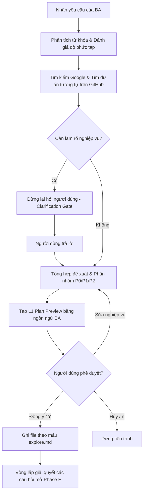

# Tài liệu đối chiếu Primitives: Claude Code vs Antigravity

Tài liệu này cung cấp bảng đối chiếu các khái niệm cốt lõi (primitives) giữa Claude Code CLI và Google Antigravity IDE giúp Business Analyst và nhà phát triển dễ dàng cấu hình và vận hành các bộ skill nghiệp vụ.

---

## 1. Bảng đối chiếu các khái niệm cơ bản

| Khái niệm (Concept) | Claude Code CLI | Google Antigravity IDE | Cơ chế hoạt động trong Antigravity |
|---------------------|-----------------|------------------------|-----------------------------------|
| **Lệnh gạch chéo** | `/explore <yêu cầu>` | Gọi skill bằng text hoặc gõ trong chat box | Antigravity nhận dạng đầu vào qua ngôn ngữ tự nhiên hoặc từ khóa tiền tố để kích hoạt skill thích hợp. |
| **Đính kèm tài liệu**| `@docs/feature/urd.md` | Dùng liên kết Markdown `[urd.md](file:///...)` hoặc nhập đường dẫn tuyệt đối | Antigravity tự động phân tích đường dẫn tệp tin và đọc nội dung bằng công cụ `view_file` có sẵn trong hệ thống. |
| **Quy tắc kiểm soát** | Tệp quy tắc `.claude/rules/*.md` | Thư mục quy ước trong workspace `.claude/rules/*.md` kết hợp System Instructions | Agent Antigravity đọc trực tiếp các tệp quy ước này trong workspace trước khi thực hiện viết/sửa bất kỳ tài liệu nào. |
| **Duyệt kế hoạch (L1)**| L1 Plan Preview (bảng log hệ thống) | Duyệt kế hoạch bằng ngôn ngữ nghiệp vụ tự nhiên (Prose Preview) | Antigravity in ra tóm tắt bằng chữ mô tả các tệp tin sẽ tạo/sửa đổi nghiệp vụ, sau đó dừng lại chờ phản hồi từ người dùng (Y/n/Sửa). |
| **Duyệt mã nguồn (L2)**| L2 Unified Diff confirm | Unified Diff hiển thị trực tiếp trong chat box | Antigravity hiển thị khối thay đổi (diff) cho các tệp cập nhật và chờ người dùng xác nhận thông qua câu lệnh. |
| **Vòng lặp tinh chỉnh (L3)**| L3 Iterate loop (Monospace render) | Vòng lặp phản hồi trực tiếp tối đa 3 lần trong chat | Sử dụng để tinh chỉnh sơ đồ luồng ASCII hoặc các bản nháp trước khi lưu đĩa. |

---

## 2. Chi tiết luồng tương tác của Skill trong Antigravity

---

## 3. Quy tắc viết tài liệu của BA trong Antigravity

Khi sử dụng các skill BA trong Antigravity, hãy lưu ý:
1. **Sử dụng đường dẫn tuyệt đối dạng Forward Slash**: Đối với hệ điều hành Windows, hãy định dạng liên kết tệp tin dạng `[urd.md](file:///d:/AI4BA/docs/payment/urd.md)` để đảm bảo khả năng nhấp chuột mở tệp hoạt động chính xác trong giao diện.
2. **Quy định ngôn ngữ**: Toàn bộ nội dung tài liệu, bản mẫu và sơ đồ luồng nghiệp vụ sẽ được viết bằng **tiếng Việt**.
3. **IT-BA Framing**: Tránh sử dụng các thuật ngữ lập trình cấp thấp (như tên cột database, kiểu dữ liệu, các phương thức mã hóa token JWT, API endpoint cụ thể) mà chỉ dùng ngôn ngữ nghiệp vụ để mô tả hoạt động hệ thống.
