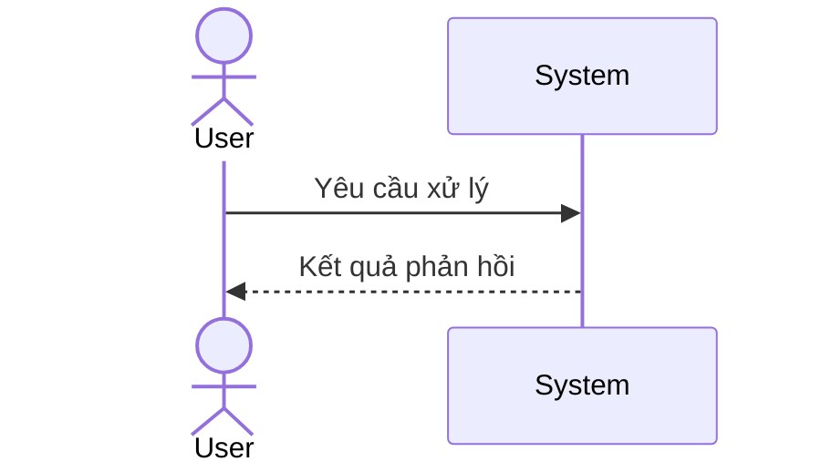
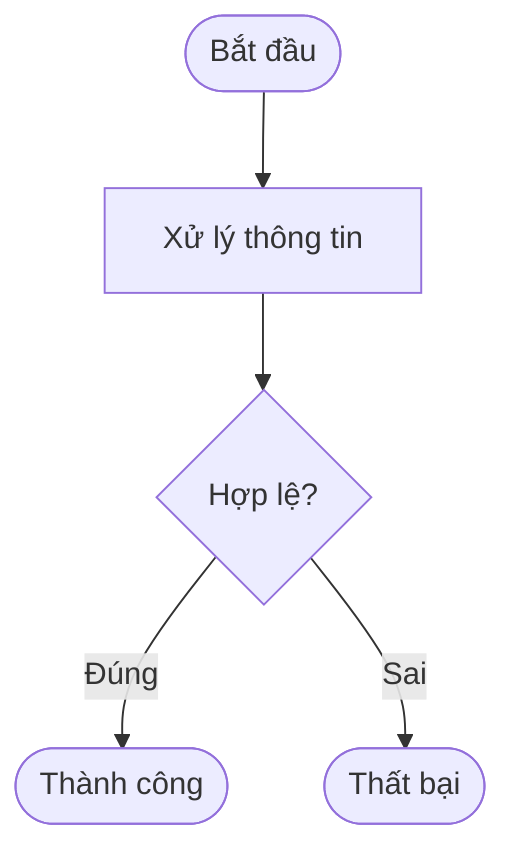
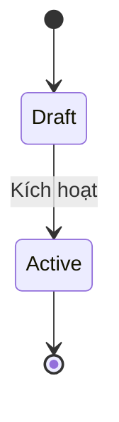
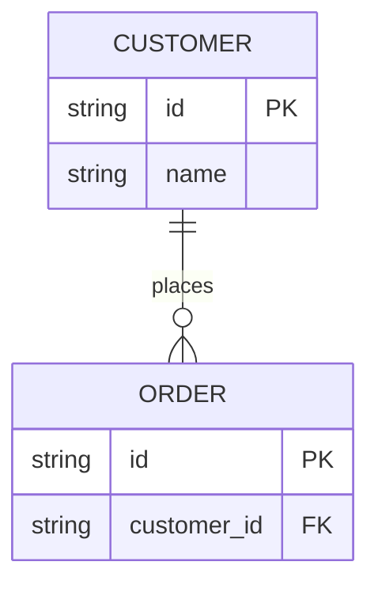
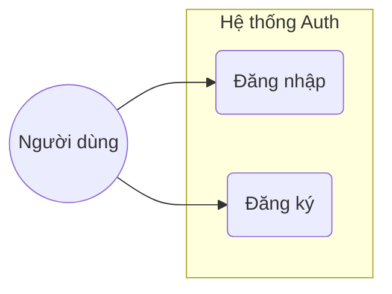
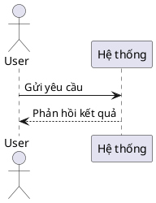
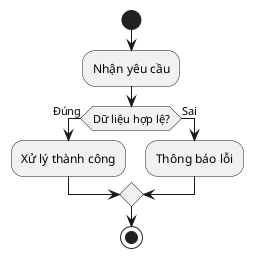
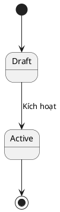
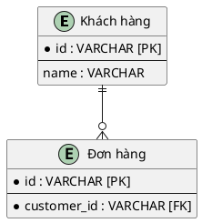
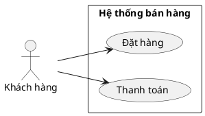

# /diagram

## Goal
- Tự động phân tích ngữ cảnh từ tài liệu hiện có trong feature để đề xuất loại diagram (Sequence, Activity, State, ERD, Use Case) và vẽ sơ đồ tương ứng bằng cú pháp được người dùng lựa chọn (Mermaid hoặc PlantUML).
- Ghi dữ liệu sơ đồ vào đường dẫn cố định được cấu hình sẵn cho từng loại diagram.

## Constraints (Ràng buộc Cứng)
1. **Rà soát tài liệu tự động**: Ngay sau khi kích hoạt, AI bắt buộc phải quét toàn bộ các file trong thư mục `docs/{feature}/` để hiểu rõ ngữ cảnh nghiệp vụ liên quan đến diagram cần vẽ.
2. **Hỏi xác nhận loại sơ đồ & công nghệ vẽ**:
   - Sau khi phân tích, AI đề xuất loại diagram phù hợp nhất kèm giải thích ngắn gọn dựa trên ma trận quyết định.
   - AI **bắt buộc phải hỏi người dùng**:
     - *Xác nhận loại diagram đề xuất* (người dùng có thể đồng ý hoặc chọn loại khác).
     - *Lựa chọn phương thức vẽ*: **PlantUML** hay **Mermaid**.
   - AI chỉ được tiếp tục sinh mã nguồn sơ đồ sau khi người dùng trả lời và xác nhận.
3. **Đường dẫn ghi file cố định**:
   - Sơ đồ **Sequence** và **Activity** $\rightarrow$ `docs/{feature}/srs/flows.md` (Ghi tiếp vào mục `## Flow: {title}`).
   - Sơ đồ **State** $\rightarrow$ `docs/{feature}/srs/states.md` (Ghi tiếp vào mục `## Entity: {EntityName}`).
   - Sơ đồ **ERD** $\rightarrow$ `docs/{feature}/srs/erd.md`.
   - Sơ đồ **Use Case** $\rightarrow$ `docs/{feature}/usecases/diagram.md`.
   *Tuyệt đối không sử dụng flag tùy ý hoặc ghi vào file Use Case của từng ca sử dụng cụ thể.*
4. **Yêu cầu flag `--update`**: Nếu file đích đã tồn tại và hành động vẽ không phải là tạo mới hoàn toàn, AI bắt buộc phải từ chối thực hiện nếu thiếu tham số `--update`.
5. **Approval Gates**:
   - **L1 (Plan)**: In rõ đường dẫn file đích, hành động (Thêm/Sửa) và tóm tắt nội dung để người dùng gõ `y` trước khi write.
   - **L2 (Diff)**: Nếu chỉnh sửa file đã tồn tại, hiển thị mã unified diff và chờ người dùng duyệt `y`.
   - **L3 (Iterate)**: Không áp dụng do sơ đồ không render trực tiếp trong hội thoại chat.
6. **Định tuyến nhật ký thay đổi (Changelog Routing)**:
   - Các file diagram không chứa changelog trực tiếp trong frontmatter. Nhật ký thay đổi bắt buộc phải được định tuyến về file spec cha tương ứng:
     - `srs/flows.md`, `srs/states.md`, `srs/erd.md` $\rightarrow$ Ghi vào `changelog` của `srs/spec.md` với các nhãn tương ứng `[flows]`, `[states]`, `[erd]`.
     - `usecases/diagram.md` $\rightarrow$ Ghi vào `changelog` của `usecases/_index.md` với nhãn `[diagram]`.
7. **Abstraction Boundary**: Tuyệt đối không chèn trực tiếp sơ đồ sequence hoặc sơ đồ kỹ thuật vào file spec Use Case kinh doanh (business black-box). Nếu người dùng yêu cầu, hãy từ chối và giải thích quy tắc ranh giới trừu tượng.

## Inputs
- `/diagram "<mô tả ngắn gọn về luồng/thực thể/sơ đồ>" --feature <slug>`
- `/diagram "<mô tả ngắn gọn về luồng/thực thể/sơ đồ>" --feature <slug> --update`

## Context (dynamic)
Các tính năng hiện có trong dự án:
!`for d in docs/*; do [ -d "$d" ] && basename "$d"; done`

Các file sơ đồ hiện có trong các tính năng:
!`for f in docs/*/srs/flows.md docs/*/srs/states.md docs/*/srs/erd.md docs/*/usecases/diagram.md; do [ -f "$f" ] && echo "$f"; done`

## Approach (Quy trình thực hiện)
1. **Phân tích đối số**: Đọc tham số `--feature` và nội dung mô tả từ câu lệnh của người dùng.
2. **Quét tài liệu (Scan)**: 
   - Đọc các file spec hoặc usecase hiện tại trong thư mục `docs/{feature}/` để thu thập thông tin về luồng xử lý, thực thể, actors, các trạng thái hoặc dữ liệu liên quan.
3. **Phân tích & Đề xuất (Decision Matrix)**:
   - Đối chiếu thông tin thu thập được với **Ma trận Quyết định** để chọn loại diagram tối ưu:
     - Có $\ge 2$ actors tương tác theo thứ tự thời gian $\rightarrow$ Sequence Diagram.
     - Entity có $\ge 3$ trạng thái và có các quy tắc chuyển trạng thái phức tạp $\rightarrow$ State Diagram.
     - Luồng nghiệp vụ có $\ge 3$ nhánh rẽ nhánh quyết định (if/else), xử lý song song hoặc loop $\rightarrow$ Activity Diagram.
     - Cần bao quát scope hệ thống, tương tác giữa các actors và use cases ($\ge 3$ actors, $\ge 3$ UCs) $\rightarrow$ Use Case Diagram.
     - Cần mô hình hóa cấu trúc dữ liệu và quan hệ giữa các bảng ($\ge 2$ thực thể) $\rightarrow$ ERD.
4. **Hỏi xác nhận (Prompt Confirmation)**:
   - Trình bày kết quả phân tích: loại diagram đề xuất và lý do chọn lựa.
   - Đưa ra câu hỏi lựa chọn công nghệ vẽ sơ đồ cho người dùng: **PlantUML** hay **Mermaid**.
   - *Dừng lại chờ phản hồi từ người dùng.*
5. **Sinh mã sơ đồ (Generate Code)**:
   - Sau khi có xác nhận, sinh mã sơ đồ tương ứng dựa theo hướng dẫn cú pháp an toàn (Mermaid hoặc PlantUML).
6. **Duyệt kế hoạch ghi (L1/L2 Approval)**:
   - Hiển thị preview đường dẫn ghi, tóm tắt và diff (nếu có `--update`). Chờ người dùng gõ `y`.
7. **Ghi file (Write/Append)**: Ghi mã sơ đồ vào đúng file đích cố định theo cấu trúc.
8. **Định tuyến Changelog**: Ghi nhận log thay đổi với prefix tương ứng vào file cha (`srs/spec.md` hoặc `usecases/_index.md`).
9. **Báo cáo kết quả**: Thông báo đường dẫn file sơ đồ đã được cập nhật thành công.

---

## Cú Pháp An Toàn (Syntax Safety Reference)

### 1. Mermaid Syntax

#### Sequence Diagram

#### Activity / Flowchart
- **Cấm** sử dụng dấu ngoặc kép đôi `"` bên trong định dạng hình khối như `ID[Text]`, `ID(Text)`.
- Xuống dòng trong nhãn dùng ` `.
- Tránh các ký tự đặc biệt trùng với cú pháp Mermaid (nếu cần dùng, escape bằng mã ASCII hoặc bỏ dấu ngoặc).

#### State Diagram
- Không bao quanh tên trạng thái bằng dấu ngoặc kép.

#### ERD
- Tên quan hệ bắt buộc nằm trong dấu ngoặc kép `"..."`.

#### Use Case Diagram (Flowchart LR Workaround)

---

### 2. PlantUML Syntax

#### Sequence Diagram

#### Activity Diagram (Cú pháp mới - Beta)
- Sử dụng cấu trúc rẽ nhánh `if (...) then (...) else (...) endif` hoặc `fork / fork again / end fork` (cho luồng song song).
- **Chú ý quan trọng:** Tuyệt đối tránh sử dụng cú pháp rẽ nhánh song song dạng `split / split and / end split` vì cú pháp này không tương thích ngược và gây lỗi cú pháp (Syntax Error) trên các phiên bản PlantUML cũ (ví dụ: các phiên bản cũ hơn hoặc bằng v1.2021.00).

#### State Diagram

#### ERD

#### Use Case Diagram

